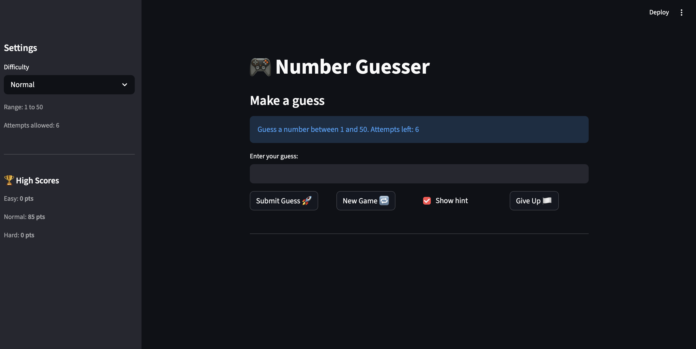

# 🎮 Game Glitch Investigator: The Impossible Guesser

## 🚨 The Situation

You asked an AI to build a simple "Number Guessing Game" using Streamlit.
It wrote the code, ran away, and now the game is unplayable. 

- You can't win.
- The hints lie to you.
- The secret number seems to have commitment issues.

## 🛠️ Setup

1. Install dependencies: `pip install -r requirements.txt`
2. Run the broken app: `python -m streamlit run app.py`

## 🕵️‍♂️ Your Mission

1. **Play the game.** Open the "Developer Debug Info" tab in the app to see the secret number. Try to win.
2. **Find the State Bug.** Why does the secret number change every time you click "Submit"? Ask ChatGPT: *"How do I keep a variable from resetting in Streamlit when I click a button?"*
3. **Fix the Logic.** The hints ("Higher/Lower") are wrong. Fix them.
4. **Refactor & Test.** - Move the logic into `logic_utils.py`.
   - Run `pytest` in your terminal.
   - Keep fixing until all tests pass!

## 📝 Document Your Experience

### 🎯 Game Purpose

Number Guesser is a Streamlit-based guessing game where the player tries to guess a secret number within a limited number of attempts. Each wrong guess deducts points and gives a directional hint (Go Higher / Go Lower). Winning earlier earns more points, and scores are tracked per difficulty level on a persistent leaderboard.

---

### 🐛 Bugs Found

| # | Location | Bug | Symptom |
|---|---|---|---|
| 1 | `check_guess` | Hint messages were swapped | Guessing too high told you to "Go HIGHER", making the game unwinnable |
| 2 | `check_guess` | `try/except TypeError` masked a type confusion bug | On even attempts, the secret was silently cast to `str`, causing broken lexicographic comparison (`"9" > "10"` is `True` in Python) |
| 3 | `update_score` | Win formula used `attempt_number + 1` | First-attempt win scored 80 instead of 100 — always one step off |
| 4 | `update_score` | "Too High" on even attempts gave `+5` instead of `-5` | Wrong guesses sometimes rewarded points |
| 5 | Session state | `attempts` initialized to `1` instead of `0` | First guess was counted as attempt 2, skewing scores and attempt display |
| 6 | `get_range_for_difficulty` | Normal and Hard ranges were swapped | Hard (1–50) was easier than Normal (1–100) |
| 7 | `attempt_limit_map` | Easy and Normal attempt limits were swapped | Normal had more attempts than Easy |
| 8 | New game handler | `status` and `history` were not reset | Win/loss message persisted into the next game |

---

### 🔧 Fixes Applied

**`check_guess`**
- Swapped the return messages so `guess > secret` correctly says "Go LOWER" and vice versa
- Removed the entire `try/except` block and the caller-side string conversion — secret is always passed as `int`

**`update_score`**
- Changed formula from `100 - 10 * (attempt_number + 1)` to `100 - 10 * (attempt_number - 1)` so attempt 1 = 100 pts
- Removed the even-attempt `+5` reward — all wrong guesses now consistently deduct 5 pts

**Session state**
- Changed `st.session_state.attempts` initialization from `1` to `0`
- Added `st.session_state.status = "playing"` and `st.session_state.history = []` to the new game handler

**Difficulty settings**
- Swapped Normal/Hard ranges: Normal → `(1, 50)`, Hard → `(1, 100)`
- Swapped Easy/Normal attempt limits: Easy → `8`, Normal → `6`, Hard → `5`

## 📸 Demo

- [ ] [Insert a screenshot of your fixed, winning game here]

## 🚀 Stretch Features

